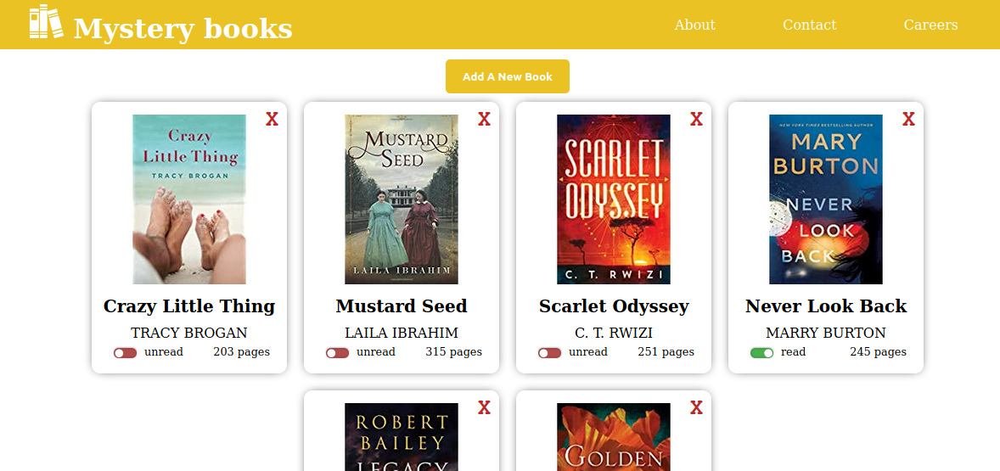

# Library

> This a book Library project where it show's different books that are available in the store and allow the user to add more books or delete some other ones

## Built With

- HTMl,
- CSS,
- Javascript

## Live Demo

[Live Demo Link](https://livedemo.com)

## Getting Started

clone the repository to get a local copy.

## Authors

👤 **Zakariae El Mejdki**

- Github: [@elmejdki](https://github.com/elmejdki)
- Twitter: [@zakariae_elmejdki](https://twitter.com/zakariaemejdki)
- Linkedin: [El Mejdki Zakariae](https://www.linkedin.com/in/zakariaeelmejdki/)

👤 **Chukwuebuka Paul Ajuizeogu**
- Github: [@misterpaul4](https://github.com/misterpaul4)
- Twitter: [@paulajuze](https://twitter.com/paulajuze)
- Linkedin: [Chukwuebuka Paul Ajuizeogu](https://www.linkedin.com/in/chukwuebuka-paul-ajuizeogu/)

## 🤝 Contributing

Contributions, issues and feature requests are welcome!

Feel free to check the [issues page](issues/).

## Show your support

Give a ⭐️ if you like this project!

## 📝 License

This project is [MIT](lic.url) licensed.
